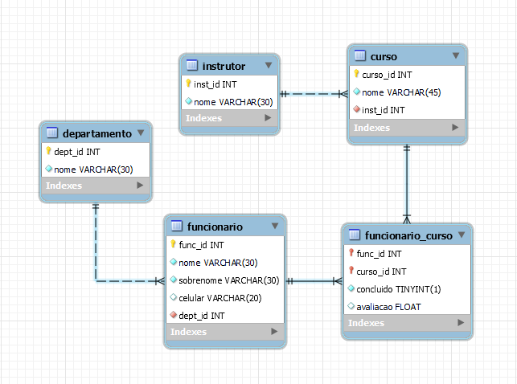

# Projeto 2° Bimestre

## Introdução

Trabalho desenvolvido por Heberth Santos e Vitor Bertelli referente a disciplina de Banco de Dados II. É importante dizer que neste documento estão somente as partes consideradas mais importante dos códigos. Porém, todos os códigos usados para a contrução do projeto estão separados em scripts e disponíveis no [GitHub](https://github.com/vitorbertelli/trabalho_bd2).

## Arquitetura do Banco de Dados

A partir do modelo criado usando o MySQL Workbench foi gerado o [script](https://github.com/vitorbertelli/trabalho_bd2/blob/main/script.sql) para a arquitetura do Banco de Dados.

<p align="center">
  
<p/>
  
## Popular o Banco de Dados

Para popular as tebelas foram usadas stored procedures.

``` sql
DELIMITER $$
CREATE PROCEDURE povoar_curso(IN num_curso INT)
BEGIN
  DECLARE Id INT DEFAULT 1;
  DECLARE num_inst INT DEFAULT (SELECT COUNT(*) FROM instrutor);
  WHILE Id <= num_curso DO
    INSERT INTO curso(curso_id, nome, inst_id) VALUES (Id, CONCAT('Curso - ',CAST(Id AS CHAR)), FLOOR(1 + (RAND() * 20)));
    SET Id = Id + 1;
  END WHILE;
END $$
DELIMITER ;
```

Para deixar o projeto mais 'humanizados', utilizamos bibliotecas do Python para popular as tabelas Funcionario e Funcionario_Curso com dados falsos.

``` python
def povoar_funcionario(num_func):

  query = "SELECT COUNT(*) FROM departamento"
  cur.execute(query)
  result = cur.fetchone();

  num_dept = result[0]
  func_id = 1

  for _ in range(num_func):
    nome = fake.first_name()
    sobrenome = fake.last_name()
    celular = fake.cellphone_number()
    dept_id = randint(1, num_dept)

    query = "INSERT INTO funcionario (func_id, nome, sobrenome, celular, dept_id) VALUES (%s, %s, %s, %s, %s)"
    values = (func_id, nome, sobrenome, celular, dept_id)
    cur.execute(query, values)
    func_id += 1
```

Foram utlizadas tanto a biblioteca oficial do [MySQL](https://pypi.org/project/mysql-connector-python/) quanto o [Faker](https://pypi.org/project/Faker/0.7.4/) para gerar dados falsos.

## Consultas

### 1° Consulta:

Imprimir a quantidade de funcionários com o sobrenome Moreira por departamento:

``` sql
SELECT d.nome 'Departamento', COUNT(*) 'Moreira'
FROM funcionario f, departamento d
WHERE f.dept_id = d.dept_id AND f.sobrenome = 'Moreira'
GROUP BY d.dept_id
ORDER BY d.dept_id;
```

### 2° Consulta:

Avaliação média dos funcionários por departamento para o Curso 1:

``` sql
SELECT dept_id 'Departamento', AVG(avaliacao) 'Média'
FROM funcionario f, funcionario_curso fc
WHERE f.func_id = fc.func_id AND curso_id = 1
GROUP BY dept_id
ORDER BY dept_id;
```

### 3° Consulta:

Nome e quantidade de cursos do funcionário que está cadastrado em mais cursos:

``` sql
SELECT f.nome 'Nome', COUNT(fc.curso_id) 'Cursos' 
FROM funcionario f, funcionario_curso fc
WHERE f.func_id = fc.func_id
GROUP BY f.func_id
HAVING COUNT(fc.curso_id) = (
    SELECT COUNT(curso_id)
    FROM funcionario_curso
    GROUP BY func_id
    ORDER BY COUNT(curso_id) DESC
    LIMIT 1
);
```

## Otimizar

## Estruturas avançadas

Foi implementado um trigger que garante que as avaliações dos cursos fiquem sempre entre 0 e 5. 

``` sql
DELIMITER $$
CREATE TRIGGER avaliar_curso_insert BEFORE INSERT
ON funcionario_curso
FOR EACH ROW
BEGIN
  IF NEW.avaliacao > 5.0 or NEW.avaliacao < 0 THEN
    SIGNAL SQLSTATE'45000' SET MESSAGE_TEXT = 'A nota para o curso tem que ser entre 0 e 5.';
  END IF;
END $$
DELIMITER ;
```

Para melhor performance, é essencial garantir que um trigger seja sempre acionado antes da inserção de dados na tabela ou antes de uma atualização de registro.
